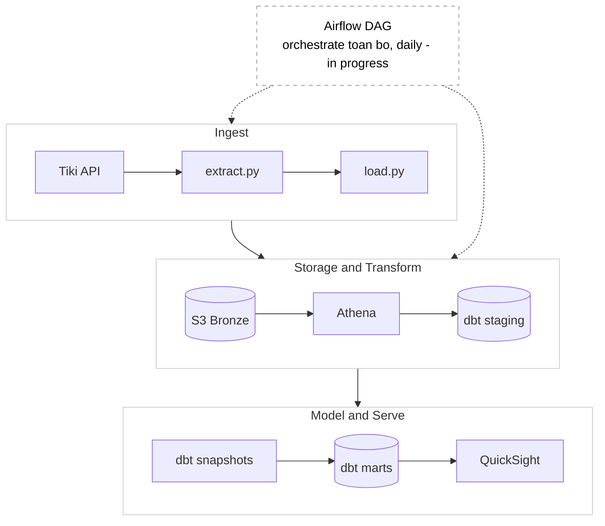

# Tiki E-commerce ELT Pipeline Project

_________
## Overview
An automated data pipeline that tracks Tiki.vn product prices and seller metrics across multiple categories.

## Architecture & Tech stack


**Ingestion:**    Python (requests, tenacity)

**Storage:**      AWS S3 (Bronze - raw JSON)

**Warehouse:**     AWS Athena hoặc Redshift Serverless (Silver + Gold)

**Transform:**     dbt (dbt-athena hoặc dbt-redshift)

**Orchestration:** Airflow (Docker local)

**BI:**            Apache Superset (Docker local) hoặc AWS QuickSight

**CI/CD:**         GitHub Actions


## Structure
```
tiki-pipeline/
├── ingestion/
│   ├── extract.py          # fetch data từ Tiki API
│   ├── load.py             # upload lên S3
│   └── pipeline.py         # kết hợp extract + load, Airflow import
│
├── dbt/
│   ├── dbt_project.yml
│   ├── profiles.yml
│   ├── models/
│   │   ├── staging/        # Silver layer
│   │   │   ├── stg_products.sql
│   │   │   ├── stg_sellers.sql
│   │   │   └── stg_categories.sql
│   │   └── marts/          # Gold layer - star schema
│   │       ├── dim_product.sql
│   │       ├── dim_seller.sql
│   │       ├── dim_category.sql
│   │       ├── dim_date.sql
│   │       └── fact_product_daily_snapshot.sql
│   ├── snapshots/          # SCD Type 2
│   │   └── dim_product_snapshot.sql
│   └── tests/
│       └── generic/
│
├── airflow/
│   ├── dags/
│   │   └── tiki_pipeline_dag.py
│   └── plugins/
│
├── .github/
│   └── workflows/
│       ├── ci.yml
│       └── cd.yml
│
├── .env.example
├── .gitignore
├── docker-compose.yml      # Airflow + Superset
├── requirements.txt
└── README.md
```
